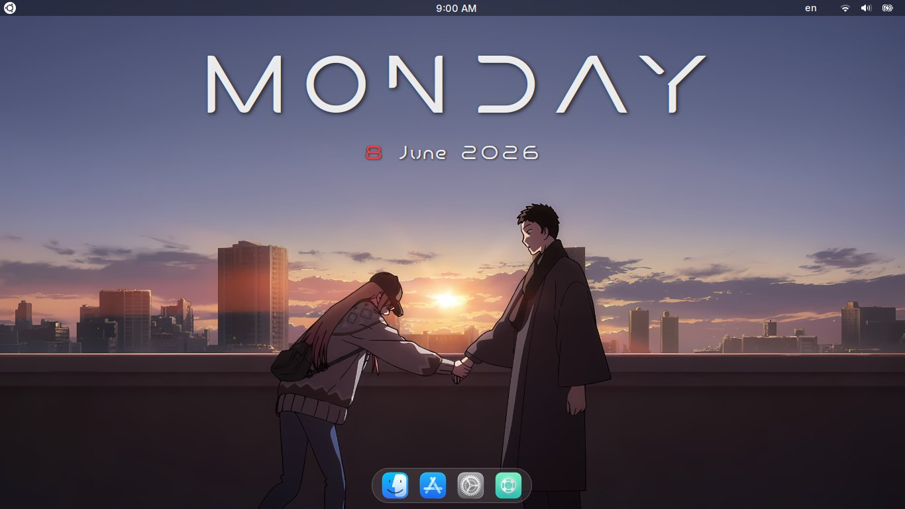
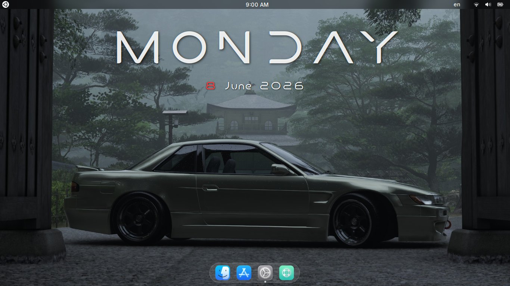
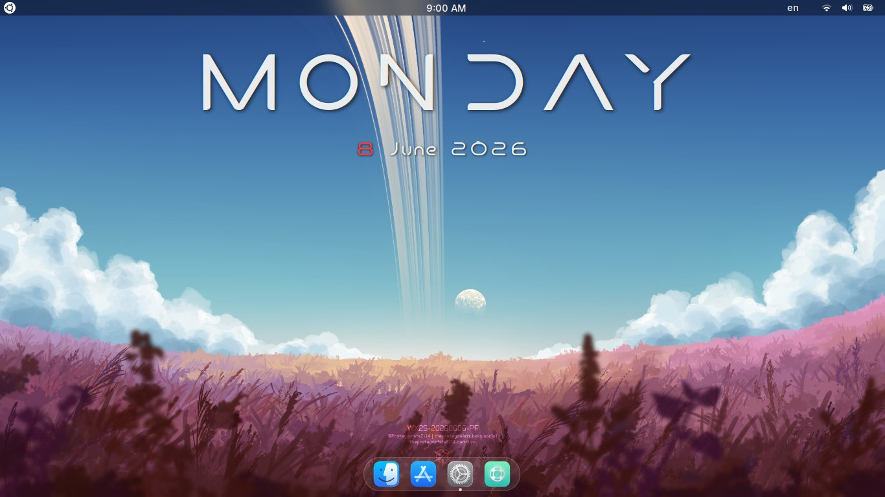

# DesktopDate

A beautiful, fully **click-through** desktop day & date widget for GNOME Wayland.

No cursor interference. No floating windows. No X11 required.



| | |
|---|---|
|  |  |

---

## Why this exists

Conky — the classic desktop widget tool — has a fundamental problem on GNOME Wayland: it creates an invisible window that intercepts mouse clicks and changes your cursor when you hover over it. There is no fix for this because GNOME does not expose the `zwlr_layer_shell` protocol to third-party apps.

**DesktopDate** solves this by running inside GNOME Shell itself, drawing directly onto `_backgroundGroup` — the layer above your wallpaper but below all windows. It is completely invisible to your cursor and mouse clicks.

---

## Features

- ✅ Fully click-through — cursor never changes
- ✅ Stays on desktop across all workspaces
- ✅ Works on GNOME Wayland — no X11 needed
- ✅ Hides behind fullscreen apps automatically
- ✅ Large day name with red date number
- ✅ Easy to customize — font, size, colors, position
- ✅ Researcher font included — no manual download needed

---

## Requirements

- GNOME Shell 45–50
- Wayland session

---

## Installation

```bash
git clone https://github.com/its-omayer/DesktopDate
cd DesktopDate/desktopdate@its-omayer
bash install.sh
```

Then **log out and back in**.

The installer will:
- Install the **Researcher** font to `~/.local/share/fonts/`
- Copy the extension to `~/.local/share/gnome-shell/extensions/`
- Enable the extension automatically

---

## Customization

Edit the constants at the top of `extension.js`:

```js
const FONT_FAMILY     = 'Researcher';                // Any font installed on your system
const FONT_SIZE_DAY   = 120;                         // Day name size in px
const FONT_SIZE_DATE  = 28;                          // Date line size in px
const COLOR_DAY       = 'rgba(255, 255, 255, 0.92)'; // Day name color
const COLOR_DAYNUM    = 'rgba(255, 60, 60, 1.0)';    // Day number color (red)
const COLOR_MONTHYEAR = 'rgba(255, 255, 255, 0.92)'; // Month and year color
const VERTICAL_POS    = 0.10;                        // 0.0 = top, 1.0 = bottom
```

Log out and back in after saving changes.

---

## How it works

GNOME Shell renders in layers. Most extensions add widgets to `Main.uiGroup` which sits **above** all windows — that's why clock extensions usually float on top of everything.

DesktopDate instead uses `Main.layoutManager._backgroundGroup`, which sits **above the wallpaper but below all app windows**. Combined with `reactive: false` on every element, the widget receives zero mouse events — completely invisible to your cursor.

---

## License

GPL-2.0
